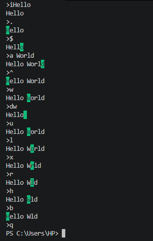

# CLI Text Editing Engine 
> **Project Date:** Spring 2025 | **Course:** Computing Lab (CSC1002)

An interactive command-line text editor in Python that replicates the core functionality and navigation of the classic Vim editor. The tool features constant state management, allowing users to navigate text, perform in-line string modification (text insertions, appends, and deletions), and toggle a visual terminal cursor rendered via ANSI escape codes. I also implemented an undo and command-repetition system by managing history stacks for both the text content and cursor states.

## Features

* **Visual Cursor Tracking:** Toggleable inline cursor highlighting to track your exact position within the string.
* **Navigation:** Move character-by-character, word-by-word, or jump to the ends of the line.
* **Command History & Undo:** Built-in state saving allows you to undo previous actions or repeat the last executed command.
* **Zero Dependencies:** Built entirely using Python's standard library.

## Usage

To run the text engine, clone the repository and execute the script in your terminal:

```bash
python text_engine.py

```

## Command List

### Navigation

| Command | Action |
| --- | --- |
| `h` | Move cursor left |
| `l` | Move cursor right |
| `^` | Move cursor to the beginning of the line |
| `$` | Move cursor to the end of the line |
| `w` | Move cursor to the beginning of the next word |
| `b` | Move cursor to the beginning of the previous word |

### String Editing

| Command | Action |
| --- | --- |
| `i<text>` | Insert `<text>` before cursor |
| `a<text>` | Append `<text>` after cursor |
| `x` | Delete character at cursor |
| `dw` | Delete word and trailing spaces at cursor |

### Utilities

| Command | Action |
| --- | --- |
| `.` | Toggle the row cursor highlighting on and off |
| `u` | Undo previous command |
| `r` | Repeat last command |
| `?` | Display this help information |
| `q` | Quit program |

## Example

```bash
> iHello World
Hello World
> ^
Hello World
> w
Hello World
> dw
Hello 
> aDeveloper
Hello Developer

```
## Example Output with Highlighted Cursor

